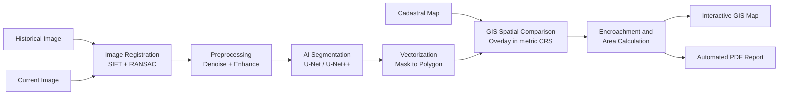

Readme · MD
# AI-Assisted Cadastral Boundary Detection and Encroachment Analysis System
 
An automated **digital screening tool** that compares a historical satellite image, a current satellite image, and an official cadastral reference map to flag **potential** land encroachment. It combines computer vision (SIFT + RANSAC image registration, U-Net / U-Net++ segmentation) with GIS spatial analysis (GeoPandas, Shapely) and produces an interactive map and an automated PDF report for survey officers.
 
> **Disclaimer:** This is an assistive screening tool. All findings indicate *potential / indicative* encroachment only and are **not legally confirmed**. Final verification requires cross-checking with official cadastral records and a physical ground survey by a certified professional surveyor.
 
---
 
## Table of Contents
 
1. [Features](#features)
2. [How It Works](#how-it-works)
3. [Technology Stack](#technology-stack)
4. [Project Structure](#project-structure)
5. [Installation](#installation)
6. [Quick Start](#quick-start)
7. [Input Data Formats](#input-data-formats)
8. [Outputs](#outputs)
9. [Training the Model](#training-the-model)
10. [Evaluation Metrics](#evaluation-metrics)
11. [Configuration](#configuration)
12. [Testing](#testing)
13. [Free Deployment](#free-deployment)
14. [Known Limitations](#known-limitations)
15. [Future Scope](#future-scope)
16. [Project Info](#project-info)
---
 
## Features
 
- **Three-input ingestion:** historical image, current image, and cadastral reference map.
- **Image registration:** SIFT keypoints + RANSAC homography so detected changes are real ground changes, not camera misalignment.
- **Image preprocessing:** noise removal, contrast enhancement (CLAHE), optional sharpening and haze reduction.
- **Deep-learning segmentation:** U-Net or U-Net++ (PyTorch + `segmentation_models_pytorch`) with tiled inference for large GeoTIFFs.
- **Vectorization:** raster mask converted into georeferenced GIS polygons (GeoJSON / Shapefile).
- **GIS spatial comparison:** overlay of the cadastral boundary and AI-detected boundary in a projected metric CRS.
- **Encroachment analysis:** original area, current area, area difference, potential encroached area, vacated area, and percentage deviation, reported in m², hectares and acres.
- **Interactive GIS map:** toggleable layers built with Folium / Leaflet.
- **Automated PDF report:** visual comparisons, area tables, boundary coordinates, AI metrics, and a mandatory legal disclaimer.
- **Fallback mode:** if no trained weights exist, a classical OpenCV pipeline runs and is clearly labelled *"classical fallback, not AI"*.
- **Zero-cost stack:** fully open source; runs on CPU, uses GPU automatically if available.
---
 
## How It Works
 

 
### Pipeline steps
 
| Step | Module | What it does |
|------|--------|--------------|
| 1. Ingestion | `core/ingestion.py` | Loads and validates inputs, reads/builds georeferencing, reprojects to a shared CRS |
| 2. Registration | `core/registration.py` | SIFT matching, Lowe ratio test, RANSAC homography, warps current image onto historical image |
| 3. Preprocessing | `core/preprocessing.py` | Noise removal, CLAHE, sharpening, haze reduction |
| 4. Segmentation | `core/segmentation.py` | Tiled U-Net / U-Net++ inference, thresholding, morphological cleanup |
| 5. Vectorization | `core/vectorization.py` | Mask to georeferenced polygon, simplification, geometry repair |
| 6. Spatial analysis | `core/spatial_analysis.py` | Boolean geometry operations and area metrics |
| 7. Metrics | `core/metrics.py` | Accuracy, Precision, Recall, IoU, Dice |
| 8. Map | `core/map_builder.py` | Interactive Folium map |
| 9. Report | `core/report.py` | ReportLab PDF generation |
 
### Area calculation logic
 
All areas are computed in a **projected metric CRS** (UTM zone auto-selected from the parcel centroid, e.g. EPSG:32643 for Nashik). Areas are never computed in EPSG:4326.
 
```
old_area              = area(cadastral polygon)
current_area          = area(AI-detected polygon)
area_difference       = current_area - old_area
encroached_geometry   = current.difference(cadastral)
vacated_geometry      = cadastral.difference(current)
encroachment_%        = encroached_area / old_area x 100
```
 
Tiny slivers below a configurable minimum area, and boundary differences within a tolerance buffer (default 0.5 m), are ignored to absorb segmentation and georeferencing error.
 
### Severity labels (configurable)
 
| Encroachment % | Label |
|----------------|-------|
| < 1% | Negligible |
| 1 - 5% | Minor |
| 5 - 15% | Moderate |
| > 15% | Significant |
 
---
 
## Technology Stack
 
| Layer | Tools |
|-------|-------|
| Deep learning | PyTorch, segmentation_models_pytorch, albumentations |
| Computer vision | OpenCV (SIFT, FLANN, RANSAC) |
| Geospatial | GeoPandas, Shapely 2.x, Rasterio, pyproj, GDAL (optional) |
| Frontend | Streamlit |
| Mapping | Folium, streamlit-folium, Leaflet, OpenStreetMap, Esri World Imagery |
| Reporting | ReportLab, matplotlib |
| Testing | pytest |
| Language | Python 3.9+ |
 
---
 
## Project Structure
 
```
cadastral_encroachment/
├── app.py                      # Streamlit entry point
├── config.py                   # All constants and thresholds
├── requirements.txt
├── README.md
├── Dockerfile                  # Optional
├── core/
│   ├── ingestion.py
│   ├── registration.py
│   ├── preprocessing.py
│   ├── segmentation.py
│   ├── vectorization.py
│   ├── spatial_analysis.py
│   ├── metrics.py
│   ├── map_builder.py
│   └── report.py
├── training/
│   ├── dataset.py
│   ├── train.py
│   └── evaluate.py
├── data/
│   ├── sample/                 # Generated demo data
│   └── generate_sample_data.py
├── models/                     # Trained weights (.pth) and metrics.json
├── outputs/                    # Reports, GeoJSON, HTML maps
└── tests/
```
 
---
 
## Installation
 
### Prerequisites
 
- Python 3.9 or newer
- `pip` and (recommended) a virtual environment
- Optional: NVIDIA GPU with CUDA for faster inference and training
### Steps
 
```bash
# 1. Clone the repository
git clone https://github.com/<your-username>/cadastral_encroachment.git
cd cadastral_encroachment
 
# 2. Create and activate a virtual environment
python -m venv venv
source venv/bin/activate          # Linux / macOS
venv\Scripts\activate             # Windows
 
# 3. Install dependencies
pip install --upgrade pip
pip install -r requirements.txt
```
 
> **Windows note:** if `rasterio` or `geopandas` fail to install via pip, use `conda install -c conda-forge geopandas rasterio` or install the prebuilt wheels.
 
---
 
## Quick Start
 
### 1. Generate sample data
 
Creates a synthetic historical image, a current image (rotated, scaled, blurred, with a simulated encroachment), a cadastral GeoJSON near Nashik, ground-truth masks, and a training set.
 
```bash
python data/generate_sample_data.py
```
 
### 2. Train the model (optional but recommended)
 
```bash
python training/train.py
python training/evaluate.py
```
 
Without trained weights the app falls back to the classical OpenCV pipeline and labels the output accordingly.
 
### 3. Launch the app
 
```bash
streamlit run app.py
```
 
Open the URL shown in the terminal (usually `http://localhost:8501`).
 
### 4. Run an analysis
 
1. Click **Use sample data**, or upload your own three files in the sidebar.
2. Enter the Plot ID and the dates of both images.
3. Choose the model (U-Net or U-Net++) and adjust thresholds if needed.
4. Click **Run Analysis**.
5. Review the tabs: **Inputs**, **Registration**, **Segmentation**, **Results**.
6. Download the PDF report, GeoJSON, or standalone HTML map.
---
 
## Input Data Formats
 
| Input | Accepted formats | Notes |
|-------|------------------|-------|
| Historical image | JPG, PNG, GeoTIFF | GeoTIFF preferred (CRS and transform read automatically) |
| Current image | JPG, PNG, GeoTIFF | Same area as the historical image |
| Cadastral map | GeoJSON, zipped Shapefile, KML, GeoPackage | Must contain a CRS; raster maps are supported only with manual georeferencing |
 
For plain JPG/PNG images with no georeferencing, provide the **bounding box or four corner coordinates** in the sidebar so the system can build a transform.
 
### Training dataset format
 
```
training_data/
├── images/   # 0001.png, 0002.png, ...
└── masks/    # 0001.png, 0002.png, ...  (binary: 255 = parcel, 0 = background)
```
 
Public datasets suitable for fine-tuning: **SpaceNet**, **Inria Aerial Image Labeling**, **DeepGlobe**, **AI4Boundaries**. For best results on Indian parcels, add labelled tiles from your own region (for example, Nashik).
 
---
 
## Outputs
 
| Output | Location | Description |
|--------|----------|-------------|
| PDF report | `outputs/report_<PlotID>.pdf` | Full change / encroachment analysis report |
| Encroachment polygons | `outputs/*.geojson` | Georeferenced potential encroachment geometry |
| Detected boundary | `outputs/*.geojson`, `.shp` | AI-detected current boundary |
| Interactive map | `outputs/map_<PlotID>.html` | Standalone Leaflet map |
 
### Map layer colours
 
| Layer | Colour |
|-------|--------|
| Official cadastral boundary | Blue |
| Historical detected boundary | Green (dashed) |
| Current AI-detected boundary | Red |
| Potential encroachment area | Yellow (filled) |
| Vacated area | Orange |
 
### PDF report contents
 
1. Survey / Plot ID, report date, image dates
2. Executive summary with severity badge
3. Before vs current image comparison
4. Registration quality (matches, inliers, RMSE)
5. Change-detection map
6. GIS map snapshot
7. Area table (m², hectares, acres) and encroachment percentage
8. Boundary coordinates of the encroachment polygon
9. AI model performance metrics
10. Methodology summary
11. Mandatory legal disclaimer (also in every page footer)
---
 
## Training the Model
 
```bash
python training/train.py
```
 
- **Architecture:** U-Net (default) or U-Net++, ResNet34 encoder with ImageNet weights
- **Loss:** BCE + Dice
- **Optimizer:** Adam with ReduceLROnPlateau
- **Augmentation:** flips, 90-degree rotations, brightness / contrast
- **Output:** best checkpoint at `models/best_model.pth` and a training-curve plot
Training on a free **Google Colab** T4 GPU is recommended for real datasets.
 
---
 
## Evaluation Metrics
 
The system reports **Accuracy, Precision, Recall, IoU, Dice** (and F1).
 
- If ground-truth masks are available (for example the sample data), the metrics are computed for that specific plot.
- Otherwise, the report shows the stored **test-set performance** from `models/metrics.json` and labels it clearly as *"model test-set performance, not for this plot."*
No metric in this project is hard-coded or fabricated.
 
| Metric | Meaning |
|--------|---------|
| Precision | How many predicted boundary pixels are correct |
| Recall | How many true boundary pixels were found |
| IoU | Overlap between prediction and ground truth |
| Dice | Shape similarity between prediction and ground truth |
 
---
 
## Configuration
 
All tunable values live in `config.py`:
 
| Setting | Default | Purpose |
|---------|---------|---------|
| `MODEL_NAME` | `Unet` | `Unet` or `UnetPlusPlus` |
| `ENCODER` | `resnet34` | Backbone encoder |
| `MASK_THRESHOLD` | `0.5` | Binarization of probability map |
| `TILE_SIZE` / `TILE_OVERLAP` | `512` / `64` | Sliding-window inference |
| `LOWE_RATIO` | `0.75` | SIFT match filtering |
| `RANSAC_THRESHOLD` | `5.0` | Homography reprojection tolerance (px) |
| `TOLERANCE_BUFFER_M` | `0.5` | Boundary tolerance in metres |
| `MIN_ENCROACHMENT_M2` | `1.0` | Ignore smaller slivers |
| `SEVERITY_THRESHOLDS` | 1 / 5 / 15 % | Severity labels |
| `MAX_FILE_SIZE_MB` | `200` | Upload limit |
 
> The legal disclaimer cannot be disabled through configuration.
 
---
 
## Testing
 
```bash
pytest tests/ -v
```
 
Test coverage includes:
 
- Registration accuracy against a known transform
- Area calculations on shapes with known areas
- Geometry difference and overlay logic
- Metric formulas on small known arrays
- Ingestion validation and error handling
- End-to-end run on sample data, asserting the detected encroachment is close to the simulated one
---
 
## Free Deployment
 
### Streamlit Community Cloud
 
1. Push the project to a public GitHub repository.
2. Go to [share.streamlit.io](https://share.streamlit.io) and connect the repo.
3. Set the main file to `app.py`.
4. Keep `requirements.txt` lean (use `opencv-python-headless` and CPU-only PyTorch for cloud hosting).
### Google Colab / Hugging Face (GPU)
 
- Use Colab (T4 GPU) for **training** and heavy inference.
- Use Hugging Face Spaces (ZeroGPU) to host the model backend if GPU inference is needed.
### Docker (optional)
 
```bash
docker build -t cadastral-ai .
docker run -p 8501:8501 cadastral-ai
```
 
---
 
## Known Limitations
 
- Accuracy depends on image quality and georeferencing accuracy.
- Clouds, shadows, seasonal vegetation changes, and construction debris can cause false detections.
- Registration can fail when the two images share too few distinctive features (for example, homogeneous farmland); the app warns when the inlier count or ratio is too low.
- The model must be trained on region-appropriate data to perform well on real parcels. Synthetic training data only proves that the pipeline works.
- Satellite imagery resolution limits the smallest detectable boundary shift.
- Results are screening-only and are not legally binding.
---
 
## Future Scope
 
- Direct satellite API integration (Sentinel Hub, Planet, Maxar) to fetch imagery from plot coordinates
- Batch processing of entire villages or municipalities
- Integration with state land record databases (for example Mahabhulekh, Maharashtra)
- Mobile companion app for field surveyors
- 3D volumetric encroachment analysis using LiDAR / DEM data
---
 
## Project Info
 
| | |
|---|---|
| **Project title** | AI-Assisted Cadastral Boundary Detection and Encroachment Analysis System |
| **Team / Author** | _Your name(s) here_ |
| **Institution** | _Your college / department_ |
| **Guide** | _Guide name_ |
| **Year** | 2026 |
| **License** | MIT (change if required) |
 
### Acknowledgements
 
PyTorch, segmentation_models_pytorch, OpenCV, GeoPandas, Shapely, Rasterio, Folium, Streamlit, ReportLab, and the open datasets SpaceNet, Inria Aerial, DeepGlobe, and AI4Boundaries.
 
---
 
*This tool assists survey officers and does not replace a certified professional survey.*
 


